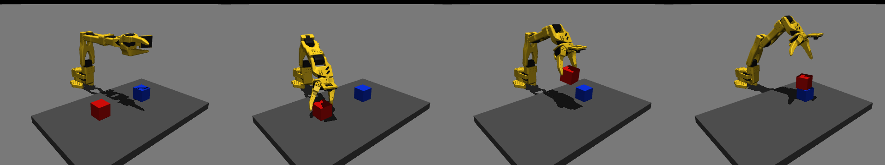
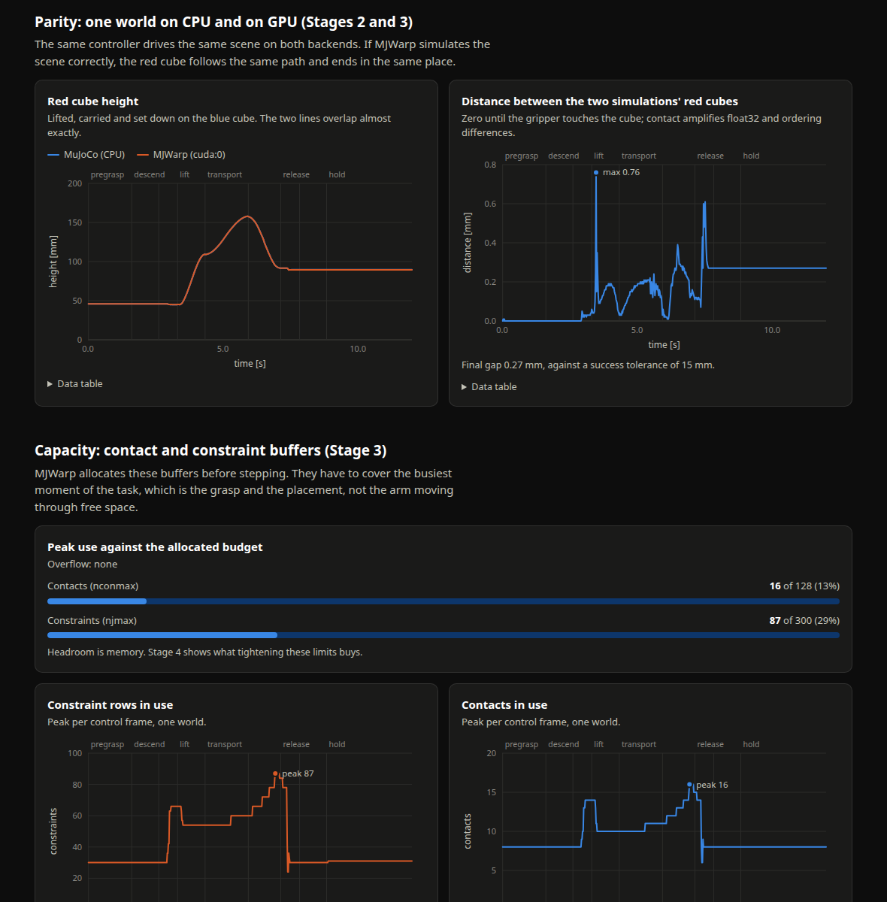
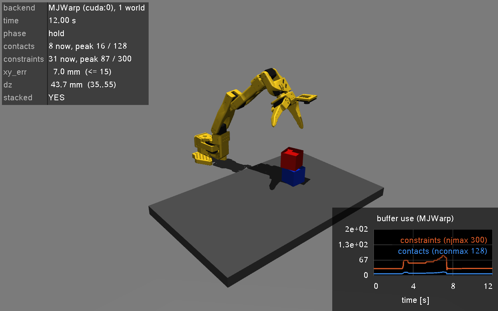
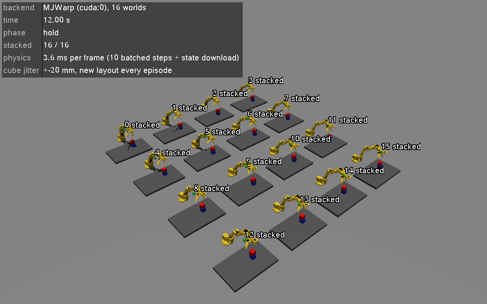

# Warp + MuJoCo Warp, stage by stage

A runnable walk through NVIDIA's article
[How to Use NVIDIA Warp and MjWarp to Accelerate Robotics Simulation and Learning Workflows](https://huggingface.co/blog/nvidia/how-to-use-nvidia-warp-and-mjwarp).

The article takes one robot task, an SO-101 arm stacking a red cube on a blue
one, and moves it from ordinary CPU MuJoCo to thousands of parallel worlds on
the GPU. It does that through five "gates". Here the gates are grouped into
four stages, one script each, plus a fifth stage that lets you watch a batch of
GPU worlds. Every script is complete: read it top to bottom, run it, compare
the output with what is described below.



## Setup

Needs an NVIDIA GPU with a recent driver, and [uv](https://docs.astral.sh/uv/).

```bash
uv sync                      # creates .venv with warp-lang, mujoco, mujoco-warp
```

The first run of Stage 2 downloads the SO-101 model from
[MuJoCo Menagerie](https://github.com/google-deepmind/mujoco_menagerie/tree/main/robotstudio_so101)
(pinned to one commit, about 18 MB) into `.generated/`.

## The big picture

```
your Python script
      │
      ├── mujoco        loads the MJCF scene, compiles it to an MjModel       (CPU)
      │
      ├── mujoco_warp   the same physics pipeline, written as Warp kernels,
      │                 over a batch of independent worlds                    (GPU)
      │
      └── warp          compiles Python kernels to CUDA and launches them     (GPU)
```

| Layer | Role |
| --- | --- |
| **Warp** | Python kernel language. You write what one thread does; Warp compiles it and runs millions of threads. |
| **MJWarp** | MuJoCo's physics reimplemented in Warp. Same MJCF model, but the state has a leading "world" dimension. |
| **The scene** | SO-101 arm from Menagerie, a table, two 44 mm cubes. |

Rule of thumb from the article: for one robot (teleoperation, MPC), CPU MuJoCo
is the right tool. MJWarp pays off when you need many worlds at once, which is
what reinforcement learning and large-scale sampling need.

## The stages

| Stage | Script | Article section | Question it answers |
| --- | --- | --- | --- |
| 1 | `01_warp_kernel.py` | Start with one useful Warp kernel | What is a kernel, and when is the GPU actually faster? |
| 2 | `02_so101_pick_place.py` | Gate 1: MuJoCo CPU baseline | Does the task work at all, and what are the reference numbers? |
| 3 | `03_so101_mjwarp.py` | Gate 2: one-world parity, Gate 3: capacity | Does MJWarp reproduce the task, and are its buffers big enough? |
| 4 | `04_scaling_study.py` | Gate 4: scale to 2,048 worlds, Gate 5: verify, then measure | How much throughput do you get, and how do you measure it honestly? |
| 5 | `05_view_batch.py` | (not in the article) | What does a batch of independent worlds actually look like? |

Supporting files, which are *not* the lesson:

- `pick_place_common.py`: the robot profile, the scene generator, the scripted controller and the success check.
- `viewing.py`: the interactive viewer loop, on-screen readouts, the grid of worlds, and recording to `results/`.
- `report.py` + `report_template.html`: turn the recordings into an interactive HTML report.

The order matters. Each gate changes one thing, so when something breaks you
know which change did it.

## Watching it run, and reviewing the results

There are two ways to look at what the stages do.

**Live, in a window.** Stages 2, 3 and 5 open the MuJoCo viewer when started
without `--headless-steps`. The task replays in a loop until you close the
window, with a live readout in the corner.

| Control | Action |
| --- | --- |
| Space | pause / resume |
| left drag, right drag, scroll | orbit, pan, zoom |
| close the window | ends the script and prints the final result |

**Afterwards, as a report.** Every headless run records what happened into
`results/`. `report.py` builds one interactive page from those recordings:

```bash
uv run python 02_so101_pick_place.py --headless-steps 600
uv run python 03_so101_mjwarp.py --headless-steps 600
uv run python 04_scaling_study.py                        # repeat with other flags to compare runs
uv run python 05_view_batch.py --headless-steps 600
uv run python report.py                                  # writes results/report.html and opens it
```



The report has four parts: parity (CPU against GPU trajectory), capacity
(how full the MJWarp buffers get, and when), scaling (throughput and latency
against batch size, one line per recorded run) and batch outcomes (where each
world's cube ended up). Hover a chart to read values; each chart has its data
table underneath. Sections without a recording say which command to run.

---

### Stage 1: one Warp kernel

```bash
uv run python 01_warp_kernel.py
```

**The idea.** A kernel is a function decorated with `@wp.kernel`. Its body is
the work of one logical thread, and `wp.tid()` tells the thread which element
it owns. `wp.launch(kernel, dim=n, ...)` runs `n` threads. The kernel here
moves points under gravity: one thread, one point.

**What to look at in the script**

- The kernel is typed (`wp.array[wp.vec3]`, `float`). Warp compiles it to
  native code; it is a subset of Python, not interpreted Python.
- `wp.array(..., device=device)` puts data on a device. `.numpy()` on a GPU
  array waits for the GPU and copies to host memory. It is not free.
- `wp.synchronize_device()` before stopping the timer. GPU launches return
  immediately; without the sync you time the queue, not the work.

**What you should see** (RTX 5090; your numbers will differ)

```
Module __main__ 5f2326f load on device 'cuda:0' took 210.80 ms  (compiled)

Part A - positions after one step on cuda:0:
[[0.       0.       0.499019]
 [0.2      0.       0.499019]]

    points   device  ms/launch    points/second
         2      cpu     0.0057          350,812
         2   cuda:0     0.0077          261,085
 4,000,000      cpu    20.3604      196,459,481
 4,000,000   cuda:0     0.1114   35,919,633,774
```

**What to notice**

- `(compiled)` on the first run becomes `(cached)` on the second. Compilation
  is a one-time cost per kernel and device.
- At 2 points the GPU is *slower*: every launch has a fixed overhead. At four
  million points it is about 180x faster than Warp's CPU backend (which runs
  the kernel serially on one core). The GPU needs a lot of parallel work per
  launch. That one observation explains everything in Stage 4.

---

### Stage 2 (Gate 1): the MuJoCo CPU baseline

```bash
uv run python 02_so101_pick_place.py                              # interactive viewer
uv run python 02_so101_pick_place.py --headless-steps 600 --debug
```

**The idea.** Before touching the GPU, get the task working in plain MuJoCo
and write down numbers to compare against. Nothing in this script knows about
Warp.

**What to look at in the script**

- The loop shape, which every later stage keeps:
  compute controls once per frame, then step physics `sim_substeps` times.
- `mjm.opt.timestep = frame_dt / sim_substeps`. 50 control frames per second
  and 10 substeps give a 0.002 s physics step. This is set once, before any
  rollout and before the model is uploaded to the GPU, so both backends
  simulate the same amount of time per step.
- `stack_check()` in `pick_place_common.py` turns "did it work" into two
  numbers: horizontal offset between the cube centres (`xy_err <= 0.015` m)
  and vertical separation (`0.035 <= dz <= 0.055` m, one cube edge with slack).

**What you should see**

```
  t= 0.00s pregrasp  |pos_err|=   0.0 mm |rot_err|=100.1 deg grip=0.00
  ...
  t= 3.40s lift      |pos_err|=   1.2 mm |rot_err|=  1.7 deg grip=0.15
  ...
6000 physics steps in 0.12 s (48,557 steps/second, 1 world, CPU)
stack check: xy_err=0.0068 dz=0.0438 -> SUCCESS
```

`xy_err` and `dz` are the reference for Stage 3. Note the speed too: one
world on one CPU core runs 12 simulated seconds in about a tenth of a second.

**In the viewer** the corner readout shows the controller phase, the contact
count and the two stack numbers moving towards their limits as the task runs.

**About the controller.** `PickPlaceController` walks through eight phases
(pregrasp, descend, close, lift, transport, lower, release, retreat). Each
frame it moves a Cartesian target along the current phase and takes one
damped-least-squares IK step towards it. It runs on the host and never steps
physics, so it works unchanged on top of either backend. It is scripted, not
learned.

---

### Stage 3 (Gates 2 + 3): one world on MJWarp

```bash
uv run python 03_so101_mjwarp.py                       # interactive viewer
uv run python 03_so101_mjwarp.py --headless-steps 600
```

**The idea.** Run the same task with one world on the GPU, keeping the host
in the loop so the same controller, viewer and stack check still work. If the
two numbers match Stage 2, MJWarp simulates this scene correctly.

**The API change is small**

| MuJoCo (host) | MJWarp (device) |
| --- | --- |
| `mujoco.MjModel` | `m = mjw.put_model(mjm)` |
| `mujoco.MjData` | `d = mjw.make_data(mjm, nworld=..., nconmax=..., njmax=...)` |
| `mujoco.mj_step(mjm, mjd)` | `mjw.step(m, d)` advances every world in `d` |
| `mjd.ctrl`, shape `(nu,)` | `d.ctrl`, shape `(nworld, nu)` |

**What to look at in the script**

- *Gate 2 setup:* `put_model`, `make_data`, then three `wp.copy` calls that
  seed `qpos`, `qvel`, `ctrl` from the host state. `mjd.qpos[None, :]` adds
  the leading world dimension: `(nq,)` becomes `(1, nq)`. Then one
  `mjw.forward` before stepping.
- *The frame loop:* identical to Stage 2 except for the inner step. Controls
  go up to the device, `mjw.step` runs, `qpos`/`qvel` come back with
  `.numpy()`. After the loop `mujoco.mj_forward` refreshes derived quantities
  like `mjd.xpos`, because writing `qpos` does not update them.
- *Gate 3 capacity:* MJWarp allocates contact and constraint buffers up
  front (`nconmax`, `njmax`). The script records the peak `d.nacon` and
  `d.nefc` over the whole task and reads the `d.overflow` bitmask. An
  overflow does not raise an exception; it prints a warning and silently
  invalidates the rollout, so it has to be checked.

**What you should see**

```
6000 physics steps in 21.99 s (273 steps/second, 1 world, cuda:0)
  (slower than the CPU on purpose: one world, with a host round-trip every step)
stack check: xy_err=0.0070 dz=0.0437 -> SUCCESS
capacity: peak contacts 16 / nconmax 128, peak constraints 87 / njmax 300
  no buffer overflow: the rollout is valid
  note: the constraint solver hit an iteration cap on some steps (<OverflowType.LS_ITERATIONS: 1024>)
```

**What to notice**

- Parity: `0.0070 / 0.0437` here against `0.0068 / 0.0438` on the CPU. Not
  bit-identical (MJWarp uses float32 and a different execution order, and
  contact dynamics amplify tiny differences), but the same task outcome.
- It is about 180x *slower* than the CPU. One world gives the GPU almost
  nothing to parallelise, and every step pays for several device-to-host
  copies. This stage validates; it does not benchmark.
- The peak of 16 contacts and 87 constraints happens mid-task, with both jaws
  and the table touching the cube. That is the moment to size buffers for,
  not the arm hovering in free space.
- The last line is not a buffer overflow. `Data.overflow` also carries bits
  for "the solver stopped at its iteration cap" (the Menagerie model sets
  `ls_iterations=20`). The script reports those separately.

**In the viewer** this stage adds a live plot of contacts and constraints in
use, so you can watch the buffers fill during the grasp and the placement.
Playback is about half real-time speed, for the reason above.



The CLI that ships with MJWarp reports buffer use too, but only for the scene
at rest (it measures 8 contacts and 30 constraints per world), which is why
the script tracks the peak through the real task:

```bash
uv run mjwarp-testspeed .generated/so101/scene_pick_place.xml --measure_alloc \
    --nworld 2048 --nconmax 128 --njmax 300 --overflow_behavior continue
uv run mjwarp-viewer .generated/so101/scene_pick_place.xml   # interactive, GPU-stepped
```

---

### Stage 4 (Gates 4 + 5): thousands of worlds, measured correctly

```bash
uv run python 04_scaling_study.py
uv run python 04_scaling_study.py --worlds 1 64 1024 2048 8192 --steps 100
uv run python 04_scaling_study.py --warm-frames 150            # replicate the mid-grasp state
uv run python 04_scaling_study.py --warm-frames 150 --nconmax 32 --njmax 128 \
    --worlds 2048 8192 16384 32768 65536
```

**The idea.** Two things change from Stage 3: `nworld`, and nothing crosses
between host and device per step. Now it is a throughput path.

**What to look at in the script** (all in `benchmark()`)

- *Gate 4:* `make_data(nworld=...)`, then `np.tile` to give every world the
  same starting state. Same calls as Stage 3; only the leading dimension grew.
- *CUDA graph capture:* `mjw.step` is many kernel launches. `wp.ScopedCapture`
  records them once; `wp.capture_launch` replays the recording with far less
  Python overhead. The graph is bound to the buffers it was captured with, so
  it is re-captured for each batch size.
- *Gate 5:* ten warm-up steps, `wp.synchronize()`, the timed loop,
  `wp.synchronize()` again, then stop the clock.
- *Verify:* finite `qpos` and no buffer-overflow bits, before the number is
  trusted.

**What you should see** (RTX 5090, scene at rest)

```
  worlds   ms/step   world-steps/s   vs CPU  x realtime  check
   CPU 1     0.008         121,545    1.00x         243
       1     0.303           3,295    0.03x           7  ok
      64     0.348         184,063    1.51x         368  ok
   1,024     0.432       2,371,387   19.51x       4,743  ok
   2,048     0.500       4,098,128   33.72x       8,196  ok
   8,192     1.058       7,744,510   63.72x      15,489  ok
```

**What to notice**

- **Latency vs throughput.** `ms/step` barely moves from 1 world to 2,048
  worlds (0.30 to 0.50 ms). One GPU world is 37x slower than one CPU world;
  2,048 of them are 34x faster in aggregate. MJWarp does not make a step
  fast, it makes a step wide.
- **The curve flattens.** With `--warm-frames 150` (mid-grasp, more contacts)
  throughput stops growing near 8,192 worlds at about 5.6 M world-steps/s;
  16,384 worlds take twice as long per step. Past that point more worlds only
  cost memory.
- **Buffers cost memory.** With the default `nconmax=128, njmax=300`, 32,768
  worlds do not fit in 32 GB. With `--nconmax 32 --njmax 128` (still above the
  measured peak of 16 and 87) 65,536 worlds fit. Throughput hardly changes,
  so on this scene tight sizing buys capacity rather than speed.
- `vs CPU` compares against one world on one CPU core. MuJoCo can also run
  rollouts on several cores, so read it as a scale, not a verdict.
- **Benchmark on an idle GPU.** If something else is using it (a training job,
  for example) the script prints a note, the numbers drop, and the
  out-of-memory point comes sooner. With another job at 100% utilisation on
  this machine, every number above was roughly halved. Such runs are flagged
  in the report.

---

### Stage 5: watch a batch of GPU worlds

```bash
uv run python 05_view_batch.py                          # 16 worlds in one window
uv run python 05_view_batch.py --worlds 64 --jitter 0.03
uv run python 05_view_batch.py --headless-steps 600     # no window, prints per-world results
```

**The idea.** Stage 4 stepped thousands of worlds without looking at them.
This stage keeps the batch small enough to draw and makes the worlds differ:
every world starts with its cubes shifted by a random offset, and all of them
run the whole pick-and-place at once. This is not in the article; it makes
"a batch of independent worlds" visible, and it follows the article's remark
that per-world randomization means writing different rows of `d.qpos`.



**What to look at in the script**

- `reset()` builds one `qpos` row per world with its own cube positions and
  uploads them in a single `wp.copy`.
- The graph is captured once and reused across episodes, because resets and
  new controls are written *into* the existing device buffers.
- `simulate_frame()` is the shape of a training loop: one action per world
  goes up, ten batched steps run on the device, one state per world comes
  back. The state download happens once per control frame, not once per
  physics step as in Stage 3.
- The "policy" here is the scripted controller, one per world, on the host.
  A learned policy would be one batched network call on the device instead.

**What you should see** (headless)

```
world    red start offset [mm]   xy_err       dz  result
    0                 (+5, -9)   0.0079   0.0437  stacked
    1               (+13, +17)   0.0042   0.0438  stacked
  ...
16 / 16 worlds stacked the cube; buffer overflow: <OverflowType.NONE: 0>
```

**What to notice**

- Each arm reaches for a slightly different spot, and the worlds drift out of
  step with each other. They are independent simulations sharing one `step`.
- A marker above each world turns green and reads "stacked" when that world
  meets the success check. With `--worlds 64 --jitter 0.03` all 64 still succeed.
- The readout shows the wall-clock cost of physics per frame. Going from 16 to
  64 worlds barely changes it: the Stage 4 result, seen live.
- Past roughly 64 worlds the window slows down. That is the host-side drawing
  and the 64 Python controllers, not the simulation.

---

## Vocabulary

| Term | Meaning |
| --- | --- |
| world | One independent copy of the scene and its state. |
| `nworld` | Number of worlds in the batch. Leading dimension of every `Data` array. |
| `nconmax` | Contact slots per world. Total capacity is roughly `nconmax * nworld`. |
| `njmax` | Constraint rows per world. Hard limit. |
| latency | Wall-clock time for one (batched) step. |
| aggregate throughput | World-steps finished per wall-clock second: `nworld * steps / seconds`. |
| graph capture | Recording a sequence of kernel launches once and replaying it. |
| parity | Same task, same success numbers, on both backends. |

## Differences from the article

- The article's companion code (`accelerated-computing-hub/tutorials/sim2real-blogs`)
  was not published when this was written, so `PickPlaceController`,
  `resolve_pick_place_scene()` and the scaling study are written from the
  article's description. The scene XML and the code in each gate follow the
  article.
- The optional reBot robot profile is left out.
- Versions used: `warp-lang 1.17.0`, `mujoco 3.14.0`, `mujoco-warp 3.14.0`.

## What this does not cover: training and inference

The article prepares and scales the simulation. It does not train or run a
policy, and neither does this repo. What you have at the end of Stage 4 is
the thing a training loop consumes: thousands of worlds stepping on the GPU
with `d.ctrl` as the input and `d.qpos` / `d.qvel` as the output, all in
device memory. The frameworks the article points to for the next step:

- [mjlab](https://github.com/mujocolab/mjlab): environments and RL training
  directly on MJWarp with PyTorch. The shortest path from here to a trained policy.
- [MuJoCo Playground](https://github.com/google-deepmind/mujoco_playground):
  JAX training recipes, using MJWarp through MJX (`impl='warp'`).
- [Newton](https://github.com/newton-physics/newton) and Isaac Lab: MJWarp as
  one solver behind a larger framework. The next articles in the series.

More on Warp itself (differentiable kernels with `wp.Tape`, deterministic
execution): [Warp documentation](https://nvidia.github.io/warp/) and
`uv run python -m warp.examples.browse`.
